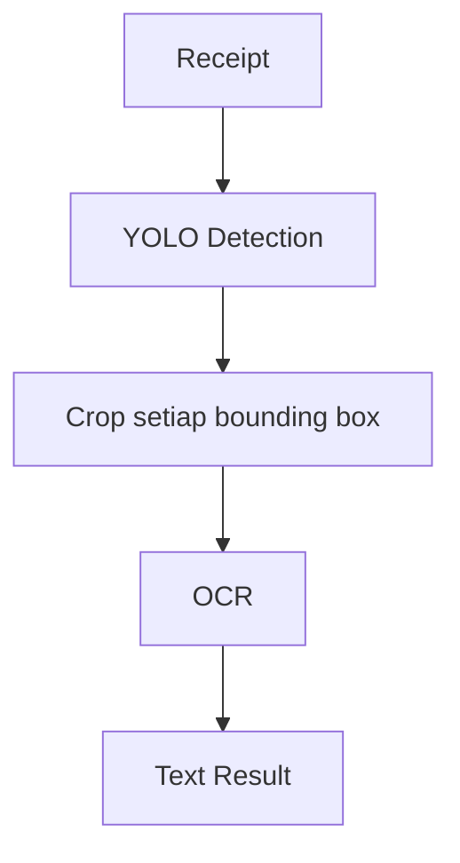
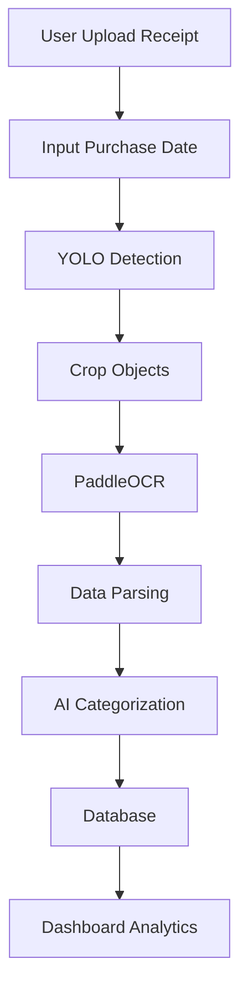

# Receipt Intelligence Platform - Workflow

## Project Overview

Receipt Intelligence Platform adalah aplikasi berbasis AI yang dapat membaca struk belanja secara otomatis menggunakan Computer Vision (YOLO) dan OCR, kemudian menyimpan hasil ekstraksi ke database serta menampilkan analisis pengeluaran dalam dashboard.

## Phase 1 - Dataset Preparation

### Objective
Menyiapkan dataset receipt untuk training model YOLO.

### Dataset
- Indonesian CORD Receipt Dataset
- Format gambar JPG/PNG
- Labeling menggunakan CVAT

### Labels
- `item`
- `qty`
- `price`
- `total`

**Catatan:**
- Tanggal transaksi tidak digunakan karena pada dataset CORD sebagian besar sudah diblur.
- Tanggal pembelian akan diinput manual oleh pengguna saat mengunggah struk.

## Phase 2 - Annotation

Menggunakan CVAT untuk membuat bounding box.

**Rules:**
- 1 item = 1 bounding box
- 1 qty = 1 bounding box
- 1 price = 1 bounding box
- Total dibuat satu bounding box yang mencakup kata TOTAL dan nominalnya.

**Contoh:**
- **qty:** `1`
- **item:** `REAL GANACHE`
- **price:** `16500`
- **total:** `TOTAL 57500`

**Setelah selesai:**
1. Review annotation
2. Export ke format Ultralytics YOLO Detection

## Phase 3 - YOLO Training

### Framework
- Ultralytics YOLO

### Input
- Dataset hasil export CVAT

### Output
Model yang mampu mendeteksi:
- `item`
- `qty`
- `price`
- `total`

### Evaluasi
- mAP
- Precision
- Recall
- F1 Score

## Phase 4 - OCR

Menggunakan **PaddleOCR**.

### Flow


*OCR hanya bertugas membaca teks dari area yang sudah dideteksi oleh YOLO.*

## Phase 5 - Data Parsing

Mengubah hasil OCR menjadi data terstruktur.

**Contoh:**
```json
{
  "date": "manual input",
  "items": [
    {
      "name": "REAL GANACHE",
      "qty": 1,
      "price": 16500
    },
    {
      "name": "ICED HIBISCUS LYCHEE TEA",
      "qty": 1,
      "price": 37000
    }
  ],
  "total": 57500
}
```

## Phase 6 - Database

Simpan hasil parsing ke database.

**Data yang disimpan:**
- `transaction_date`
- `item_name`
- `quantity`
- `price`
- `total`
- `image_path`

## Phase 7 - AI Categorization

Setelah OCR selesai, sistem akan mengkategorikan item secara otomatis.

**Contoh:**
- Indomie → Makanan
- Aqua → Minuman
- Pertalite → Transportasi
- Sabun Lifebuoy → Kebutuhan Rumah Tangga

**Kategori dapat menggunakan:**
- Rule Based
- AI Model
- LLM API

## Phase 8 - Dashboard

### Frontend menampilkan:
- Total pengeluaran
- Riwayat transaksi
- Pengeluaran per kategori
- Grafik bulanan
- Grafik mingguan
- Detail setiap receipt
- Preview gambar receipt

### User dapat:
- Upload receipt
- Mengisi tanggal pembelian secara manual
- Mengedit hasil OCR apabila terdapat kesalahan

## Technology Stack

- **Frontend:** React, Tailwind CSS
- **Backend:** FastAPI / Flask
- **Computer Vision:** Ultralytics YOLO
- **OCR:** PaddleOCR
- **Database:** PostgreSQL / SQLite
- **Visualization:** Chart.js / Recharts

## Overall Pipeline



## Development Order

1. Dataset annotation
2. YOLO training
3. YOLO inference
4. OCR integration
5. Parsing result
6. Database
7. Backend API
8. Frontend upload
9. Dashboard
10. AI categorization
11. Testing & deployment